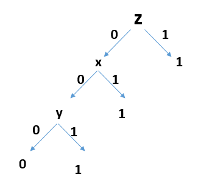

# Exercise sheet 1

	Xiaoli YANG（373917）
    Stella Coumbassa（373594）
    Jiahui Geng （365655）

## Exercise 1

|        | euclidean | manhattan |
|--------| --------- | ------------- |
| K=2  |[1;-1;-1;-1;-1]| [1;-1;-1;-1;-1]|
| K=3  |[1;-1;-1;1;1] | [1;1;1;1;-1]| 
From the table we can clearly see the comparison. When K=2, both methods (Euclidean or Manhattan) work well. 
But when K=3, the classification performs badly. 
Maybe one of the reason would be that there are only 2 labels (1,-1). 
The second reason would be voting. For example if two of three are the same label, 
even though they are farther from the candidate than the rest one, they have majority voting.

## Exercise 2



## Exercise 3

``` matlab
function [w]=perceptionLearn(x,y,learningRate,maxEpoch)  
% Perception Learn Algorithm  
% x,y ????????y??{-1,+1}  
  
[m,n]=size(x);

x=[x ones(m,1)]; 
% normalized 
max_nor= 0;
for row = 1:m
    a = 0;
    for col =1:(n+1)  
        a=a+x(row,col)^2;  
    end 
    if a> max_nor
        max_nor=a;
    end
end;
x = x/sqrt(max_nor)

w=zeros(1,n+1);
finish=true; 
num = 0;
for epoch=1:maxEpoch  
    for samlendex=1:m 
        num = num+1;
        disp(num)
        disp(w)
        if sign(x(samlendex,:)*w')~=y(samlendex)
            finish=false;  
            w=w+learningRate*y(samlendex)*x(samlendex,:)
        end  
    end  
    if finish==true  
        break;  
    end  
end  
```

> [w]=perceptionLearn(X,T,1,20);

  result:

``` matlab

 w1=
     0     0     0     0

 w2=
   -0.4216   -0.2108   -0.1054   -0.1054

 w3=
   -0.4216   -0.2108   -0.1054   -0.1054

w4=
    0.4216   -0.4216   -0.4216         0

w5=
    0.3162   -0.3162   -0.5270   -0.1054

w6=
    0.3162   -0.3162   -0.5270   -0.1054

w7=
    0.3162   -0.3162   -0.5270   -0.1054

w8=
   -0.1054   -0.5270   -0.6325   -0.2108

``` 

## Exercise 4
 1. 1 
 2. W1 =(1,....1)
    
    ...

    Wn =(1/sqrt(n),....1/sqrt(n))
3. no 