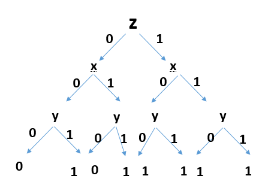

# Exercise sheet 1

	Xiaoli YANG（373917）
    Stella Coumbassa（）
    Jiahui Geng （）

## Exercise 1

|        | euclidean | manhattan |
|--------| --------- | ------------- |
| K=2  |[1;-1;-1;-1;-1]| [1;-1;-1;-1;-1]|
| K=3  |[1;-1;-1;1;1] | [1;1;1;1;-1]| 


## Exercise 2



## Exercise 3

``` matlab
function [w]=perceptionLearn(x,y,learningRate,maxEpoch)  
% Perception Learn Algorithm  
% x,y ????????y??{-1,+1}  
  
[m,n]=size(x);

x=[x ones(m,1)];  
ab = max(max(abs(x)))

x = x/ab

w=zeros(1,n+1);
finish=true;  
for epoch=1:maxEpoch  
    for samlendex=1:m  
        if sign(x(samlendex,:)*w')~=y(samlendex)
            finish=false;  
            w=w+learningRate*y(samlendex)*x(samlendex,:)
        end  
    end  
    if finish==true  
        break;  
    end  
end  
```

> [w]=perceptionLearn(X,T,1,20);

  result:

``` matlab


w1 =
   -0.5000   -0.2500   -0.1250   -0.1250


w2 =
    0.5000   -0.5000   -0.5000         0


w3 =
    0.3750   -0.3750   -0.6250   -0.1250


w4 =
   -0.1250   -0.6250   -0.7500   -0.2500
``` 

## Exercise 4
 1. k/2 -1
 2. 